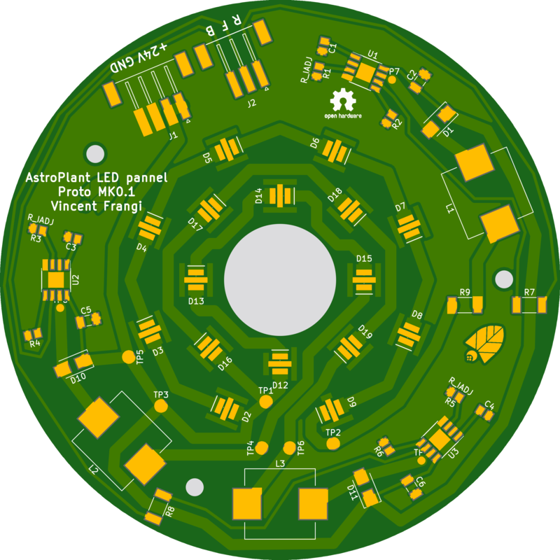
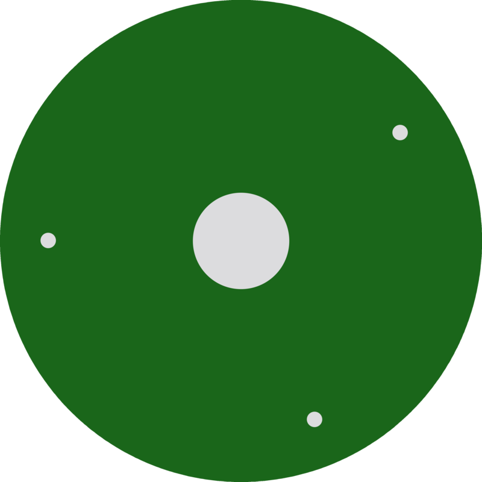

# Astroplant Led MK0.2

## About This Project

# AstroPlant LED pannel

Vincent Frangi

## Renderings

### Top

### Bottom

## BOM

|Count|Component|Details|Datasheet|
|-|-|-|-|
|4x||JUMPER W/TEST PNT 1X2PINS 2.54MM||
|4x||CONN HEADER 2 POS 2.54|[Link](http://katalog.we-online.de/em/datasheet/6130xx11121.pdf)|
|6x||CONN HEADER 1 POS 2.54||
|3x||TRIMMER 5K OHM 0.25W SMD||
|3x|R9 / R8 / R7|RES 0 OHM JUMPER 3/4W 2010||
|3x|R6 / R4 / R2|RES SMD 43K OHM 0.1% 1/8W 0805||
|3x|R5 / R3 / R1|RES SMD 3.3K OHM 0.1% 1/8W 0805||
|3x|L3 / L2 / L1|FIXED IND 47UH 2.7A 100 MOHM SMD||
|1x|J2|CONN HEADER XH SMD 3POS 2.5MM||
|1x|J1|CONN HEADER XH SMD 4POS 2.5MM||
|8x|D9 / D8 / D7 / D6 / D5 / D4 / D3 / D2|LED OSLON SSL120 RED 657NM SMD||
|4x|D19 / D18 / D17 / D16|LED OSLON SSL120 RED 727NM SMD||
|4x|D15 / D14 / D13 / D12|LED OSLON SSL120 BLUE 455NM SMD||
|3x|D11 / D10 / D1|DIODE SCHOTTKY 2A 100V SMA||
|3x|C6 / C5 / C2|CAP CER 2.7UF 25V X5R 1206||
|3x|C4 / C3 / C1|CAP CER 1UF 25V X7R 0805|[Link](https://product.tdk.com/info/en/catalog/datasheets/mlcc_commercial_general_en.pdf)|
|3x|U3 / U2 / U1|IC LED DRIVER RGLTR DIM 1A 8SO||

---

This project is managed and available on

You can view it [here](https://aisler.net/p/KXONDWSE). Start your own Powerful Prototype on [here](https://aisler.net).
